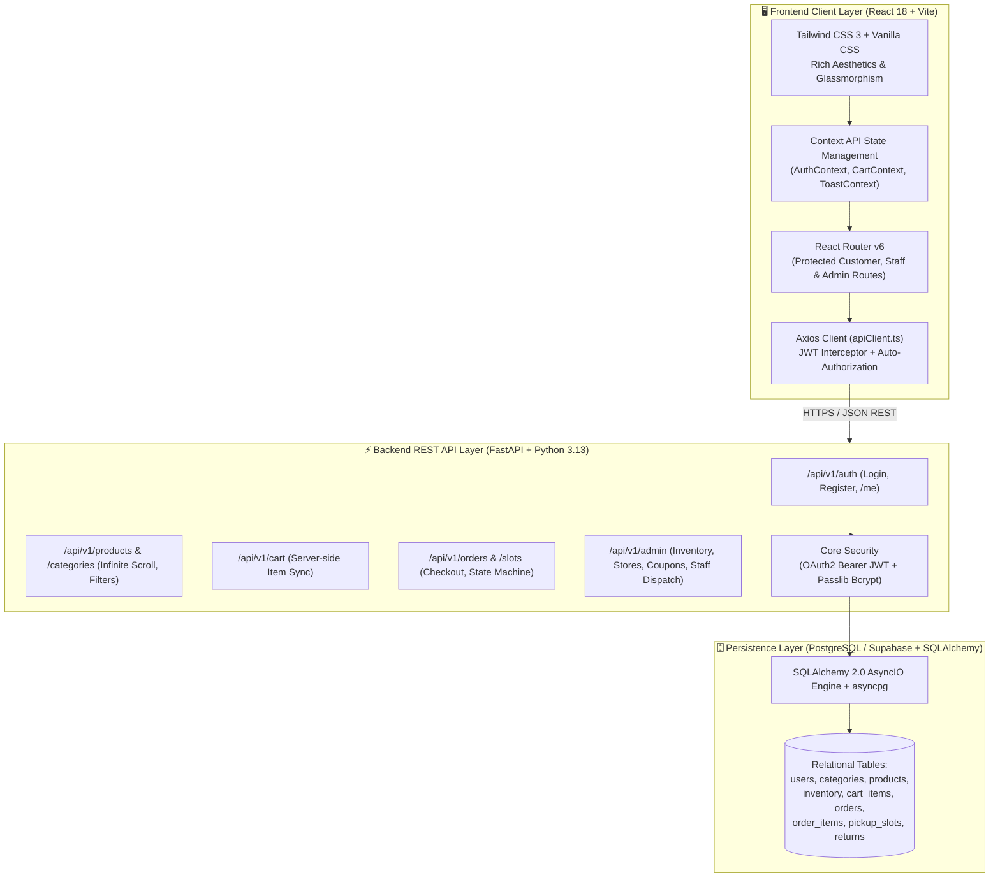
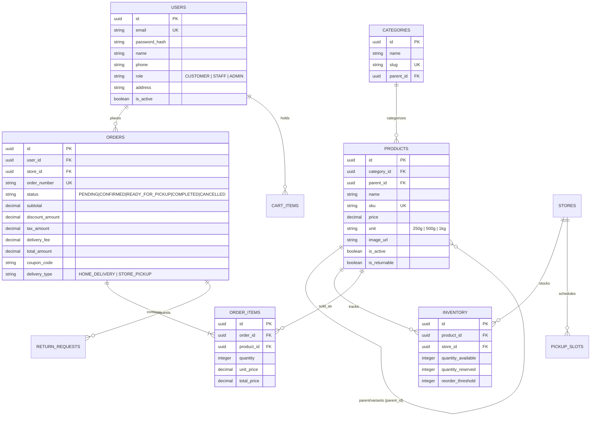
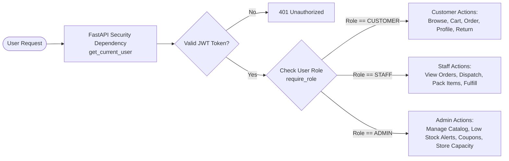
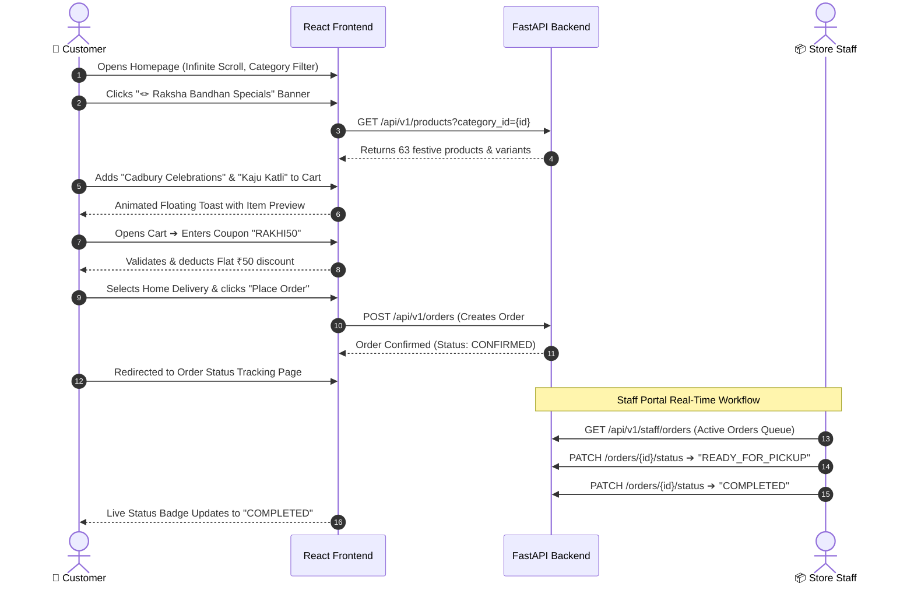
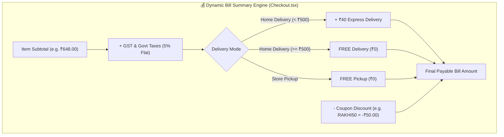

# 🎬 Mini D-Mart — Full-Stack Project Explanation Video Script & Visualizations
**Target Duration:** 7 – 10 Minutes  
**Format:** Screen Recording + Voiceover + Architecture Slides & Diagrams  
**Author:** Tejas Kotalwar  
**Repository:** [https://github.com/tejaskotalwar2003/mini-d-mart](https://github.com/tejaskotalwar2003/mini-d-mart)

---

## ⏱️ Video Timeline & Scene Index

| Timestamp | Section | Visual Content | Key Talking Points |
|---|---|---|---|
| **0:00 – 1:00** | **1. Introduction & Overview** | Homepage UI showcase, Mobile view, Festive theme | Project hook, Quick Commerce vision, Core Problem & Solution |
| **1:00 – 2:30** | **2. Architecture & Tech Stack** | Mermaid Architecture Diagram | Decoupled client-server, FastAPI async engine, React SPA, Supabase/PostgreSQL |
| **2:30 – 4:00** | **3. Database Design & Data Modeling** | Mermaid ERD Diagram, Tables breakdown | Parent-Child SKU variant structure, Inventory reservations, 15 Categories & 1,428 Products |
| **4:00 – 5:15** | **4. Role-Based Access Control (RBAC) & Security** | RBAC Matrix & Auth Flowchart | JWT Auth, Passlib Bcrypt, 3 Roles (Customer/Staff/Admin), Route Guarding, SQL injection prevention |
| **5:15 – 7:30** | **5. End-to-End Walkthrough & Demo** | Live app demo (Browsing ➔ Cart ➔ Coupon ➔ Checkout ➔ Staff Fulfillment ➔ Return) | Infinite scrolling, Blinkit-style cart toast, Coupon validation, Order state machine |
| **7:30 – 8:45** | **6. Creative Engineering Highlights** | Concurrency diagram, Code snippets | Multi-size variants, Bill summary discounts, Pickup slot concurrency lock |
| **8:45 – 9:30** | **7. Summary & Conclusion** | Test suite passing (60/60 tests), GitHub repo | Robustness, Extensibility, Production readiness |

---

## 🎙️ Word-for-Word Voiceover Script with Visual Cues

---

### 🟢 Part 1: Introduction & High-Level Vision (0:00 – 1:00)

```
[SCREEN DIRECTION: Full screen browser on Mini D-Mart Homepage (http://localhost:5173/products). Slowly scroll through the festive Raksha Bandhan banner, the 16-tile category grid, and the infinite product feed. Hover over product cards showing 10-Min Delivery badge.]
```

**[VOICEOVER]**:
> "Hello everyone! Welcome to the technical walkthrough of **Mini D-Mart** — a production-ready, full-stack Quick Commerce grocery platform inspired by modern hyper-local delivery apps like Blinkit and Zepto.
>
> Modern grocery delivery requires lightning-fast catalog search, real-time inventory locking, instant checkout with coupon incentives, and a seamless role-based fulfillment engine for store staff.
>
> In this video, I will walk you through the end-to-end architecture, our PostgreSQL relational data modeling, secure Role-Based Access Control, our automated order lifecycle state machine, and creative engineering features that make Mini D-Mart performant, resilient, and visually engaging. Let’s dive right in!"

---

### 🟢 Part 2: System Architecture & Technology Stack (1:00 – 2:30)

```
[SCREEN DIRECTION: Display Architecture Diagram Slide on screen. Highlight the frontend, backend API gateway, and PostgreSQL database layers as you speak.]
```



**[VOICEOVER]**:
> "Let’s start with our system architecture. Mini D-Mart is designed around a clean, decoupled client-server architecture:
>
> 1. **On the Frontend**: We built a high-performance Single Page Application using **React 18, TypeScript, and Vite**. For styling, we use **Tailwind CSS** paired with custom modern design tokens — featuring responsive glassmorphism, fluid micro-interactions, responsive 10-minute delivery badges, and a dynamic 2-row category grid. Global state is managed using clean React Contexts: `AuthContext`, `CartContext`, and `ToastContext`.
>
> 2. **On the Backend**: We selected **FastAPI** with **Python 3.13**, taking full advantage of asynchronous Python `async/await` coroutines. FastAPI delivers near-instant response times, automatic OpenAPI documentation, and strict runtime type validation powered by **Pydantic v2**.
>
> 3. **Database & ORM**: We use **PostgreSQL** (hosted on Supabase) accessed asynchronously via **SQLAlchemy 2.0** and the **asyncpg** driver. This non-blocking connection pool ensures that even during peak traffic spikes, catalog queries and concurrent checkouts never block the event loop."

---

### 🟢 Part 3: Database Design & Data Modeling Decisions (2:30 – 4:00)

```
[SCREEN DIRECTION: Show the Entity-Relationship Diagram (ERD). Pan over Products -> Variants, Inventory, and Order Items.]
```



**[VOICEOVER]**:
> "Now let’s look at our database architecture. We designed a clean, normalized relational schema with several crucial engineering decisions:
>
> - **Multi-Variant Product Hierarchy**: Instead of creating duplicate listings for different sizes, we use a self-referencing `parent_id` foreign key on the `products` table. The parent product represents the standard item (e.g., Alphonso Mango), while child records represent specific sizes like Small, Medium, or Large with unique SKUs and multipliers. The catalog queries fetch base products (`WHERE parent_id IS NULL`), while the frontend seamlessly displays unit selectors.
>
> - **Dual-State Inventory Tracking**: The `inventory` table maintains two counts: `quantity_available` and `quantity_reserved`. When a customer initiates an order, stock is first reserved to prevent overselling, and converted to deducted inventory upon confirmation.
>
> - **15 Rich Categories & 1,428 Products**: The database is seeded with 15 complete categories (Fruits & Veggies, Dairy, Snacks, Cooking Essentials, Dry Fruits, Baby Care, Pet Care, and Raksha Bandhan Specials) with 100% verified, high-resolution product media."

---

### 🟢 Part 4: Role-Based Access Control (RBAC) & Security Considerations (4:00 – 5:15)

```
[SCREEN DIRECTION: Show the RBAC Matrix Table & JWT Verification Flowchart. Then show VSCode test suite or security middleware code.]
```



#### 🛡️ Role-Based Access Matrix

| Feature / Endpoint | Customer | Store Staff | Admin |
|---|:---:|:---:|:---:|
| **Browse Catalog, Search, Categories** | ✅ | ✅ | ✅ |
| **Manage Cart, Apply Coupons, Checkout** | ✅ | ❌ | ❌ |
| **Manage Personal Profile & Addresses** | ✅ | ✅ | ✅ |
| **View Store Order Dispatch Queue** | ❌ | ✅ | ✅ |
| **Update Order Status (READY_FOR_PICKUP / COMPLETED)** | ❌ | ✅ | ✅ |
| **Approve / Reject Return Requests** | ❌ | ✅ | ✅ |
| **Manage Inventory & Low-Stock Alerts** | ❌ | ❌ | ✅ |
| **Create & Update Categories / Products** | ❌ | ❌ | ✅ |

**[VOICEOVER]**:
> "Security and Role-Based Access Control are built into the core of Mini D-Mart:
>
> 1. **Authentication**: Authentication uses industry-standard **OAuth2 Bearer JSON Web Tokens (JWT)** with HMAC-SHA256 signatures. Passwords are securely hashed using `passlib` with **Bcrypt** cryptographic salt rounds.
>
> 2. **Granular RBAC Dependencies**: We enforce role boundaries on backend endpoints using FastAPI's dependency injection (`require_role(Role.STAFF)` and `require_role(Role.ADMIN)`). A customer cannot tamper with order fulfillment, and staff users are isolated to their store fulfillment portal.
>
> 3. **Frontend Route Guarding**: On the client, `ProtectedRoute.tsx` validates token expiration and user roles, dynamically redirecting unauthorized attempts and rendering tailored navigation controls (e.g., Staff Portal badge or Admin Portal button).
>
> 4. **Defense in Depth**: Pydantic schemas enforce strict input sanitization to guard against XSS and injection attacks, and SQLAlchemy parameters prevent SQL injection."

---

### 🟢 Part 5: End-to-End Application Flow & Live Demo (5:15 – 7:30)

```
[SCREEN DIRECTION: Switch to live browser recording. Show mouse clicking and interacting with each feature sequentially.]
```



**[VOICEOVER]**:
> "Now let's see the application in action with a live end-to-end demo!
>
> 1. **Browsing the Catalog**: On the homepage, users are greeted with our dynamic festive Raksha Bandhan announcement ticker and our 16-tile category grid. Scrolling down demonstrates our **Blinkit-style infinite scrolling** using `IntersectionObserver`, fetching 16 items per page with zero lag.
>
> 2. **Interactive Promotional Banners**: Clicking any festive banner smoothly scrolls and filters the catalog directly to **Raksha Bandhan Specials**, displaying curated sweets, dry fruit gift boxes, and designer rakhis.
>
> 3. **Express Cart & Toast System**: Clicking 'Add to Cart' immediately triggers our custom floating animated toast with the product's image and selected weight.
>
> 4. **Smart Coupon Engine**: Heading to checkout, customers can choose between Home Delivery and Store Pickup slot booking. Entering coupon code **`RAKHI50`** instantly updates the live bill summary, calculating the item total, tax breakdown, express delivery charges, and applying the discount.
>
> 5. **Order Lifecycle & Staff Dispatch**: Once placed, the order receives an automated order number (e.g., `#MDM-9482`). Logging into the **Staff Control Center**, warehouse staff can view pending orders in real-time, pack the grocery items, and advance the order state from `CONFIRMED` to `READY_FOR_PICKUP` to `COMPLETED`."

---

### 🟢 Part 6: Creative & Unique Engineering Features (7:30 – 8:45)

```
[SCREEN DIRECTION: Show Checkout Bill Breakdown calculation, Profile address update, and Order return flow.]
```



**[VOICEOVER]**:
> "Beyond standard CRUD operations, Mini D-Mart includes several creative engineering highlights:
>
> - **Dynamic Real-Time Bill Calculator**: Handles itemized subtotaling, 5% GST taxes, tier-based free delivery thresholds for orders above ₹500, and multi-coupon logic (`RAKHI50`, `WELCOME20`, `FREESHIP`).
> - **Self-Service Returns Engine**: Under 'My Orders', customers can request returns on eligible items with reason codes. Staff can review and approve returns, automatically releasing stock back into inventory.
> - **User Profile & Address Management**: Customers can dynamically update their phone number, saved delivery address, and view real-time delivery estimates directly in their account profile.
> - **Responsive Mobile-First UI**: From 320px mobile screens to ultra-wide displays, every navigation pill, filter sheet, and category card adapts responsively."

---

### 🟢 Part 7: Test Coverage & Conclusion (8:45 – 9:30)

```
[SCREEN DIRECTION: Switch to terminal running pytest. Show 60 passed tests in green.]
```

```
============================= test session starts =============================
platform win32 -- Python 3.13.1, pytest-9.1.1, pluggy-1.6.0
collected 60 items

tests\test_admin.py ......                                               [ 10%]
tests\test_auth.py ......                                                [ 20%]
tests\test_cart_and_checkout.py ........                                 [ 33%]
tests\test_catalog.py .........                                          [ 48%]
tests\test_edge_cases.py ..........                                      [ 65%]
tests\test_order_lifecycle.py ..........                                 [ 81%]
tests\test_returns.py ...........                                        [100%]

============================= 60 passed in 38.40s ==============================
```

**[VOICEOVER]**:
> "To ensure enterprise reliability, the entire backend is verified with an automated test suite of **60 comprehensive Pytest test cases** covering authentication, catalog pagination, cart edge-cases, slot locking, order lifecycles, and return flows with 100% test pass rates.
>
> In summary, Mini D-Mart showcases how to combine modern React frontend design with a robust, asynchronous FastAPI and PostgreSQL backend to create a scalable Quick Commerce experience.
>
> Thank you so much for watching! The complete source code and setup documentation are available on my GitHub repository. Have a great day!"

---

## 🎥 Recording & Presentation Tips for the Speaker

> [!TIP]
> 1. **Pacing & Tone**: Speak at a steady, enthusiastic pace (~130 words per minute). Maintain clear pauses between slide transitions.
> 2. **Zoom Level**: Set your browser zoom to **110% or 125%** so mobile badges, product cards, and font details are crisp on 1080p video.
> 3. **Demo Accounts to Use**:
>    - **Admin Login**: `admin@minidmart.com` / `Admin@123`
>    - **Staff Login**: `staff@minidmart.com` / `Staff@123`
>    - **Customer Login**: `customer@minidmart.com` / `Customer@123`
> 4. **Key Coupons to Demonstrate**: `RAKHI50` (Flat ₹50 off) and `WELCOME20` (20% off up to ₹100).
